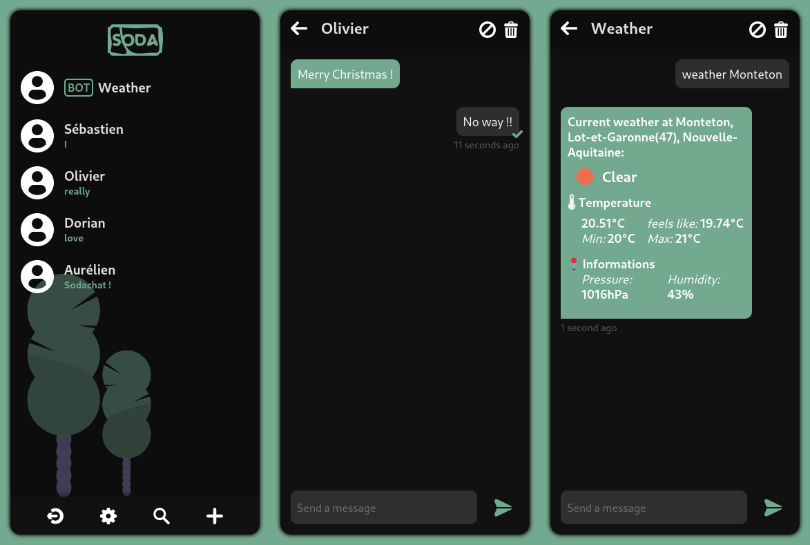

# Hello Sodachat
<p align="center"style="color: #72a98f; font-size: 1.3em;">Final year of high school project</p>

<a href="https://sodachat.chevro.fr"></a>

Sodachat is an API-based instant messenger. A web client is integrated to the API server, it is of course adapted to any kind of device.  
With Sodachat, you can chat with your friends but also talk with bots.



To use **Sodachat**, you can use our official instance or build your own (see below). Each instance is independent and they can't communicate.

<a href="https://sodachat.chevro.fr" style="color: #72a98f; font-size: 1.3em;"><p align="center">sodachat.chevro.fr</p></a>

# Installation

Start by cloning the repository
```
https://github.com/cestoliv/sodachat.git
cd sodachat
```

## Docker

    docker-compose up --build -d

Your local sodachat server will be accessible on port 8667 (you can change it in the `docker-compose.yml`).

## PipEnv

    pip install pipenv

    pipenv shell
    pipenv install
    
    python sources/server.py

## Server Admins
### Backups
 - The **database** is located under `sources/db/sodachat.db`. It is a SQLite database.

# Contribution
We are open to contributions, you can simply make a pull-request (big thanks!)  
The Sodachat API is made with Flask RestFul, the database is a SQLite database.  
The web client is developed with VueJS.